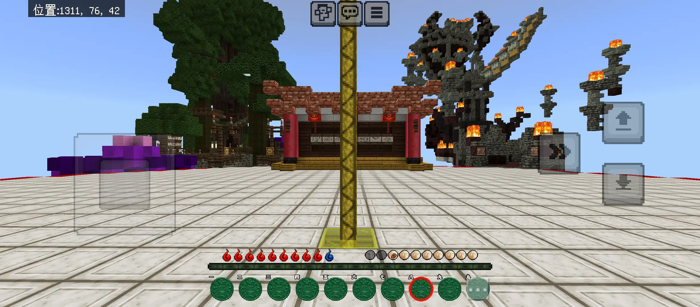
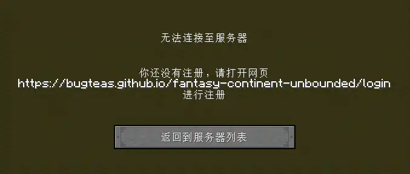
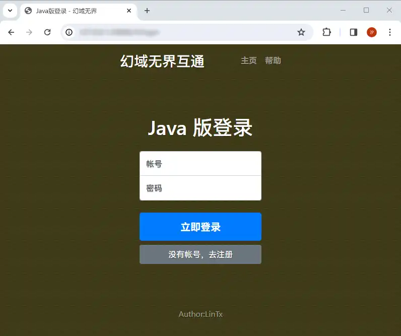
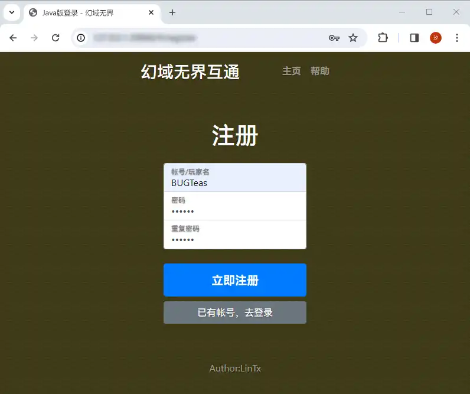
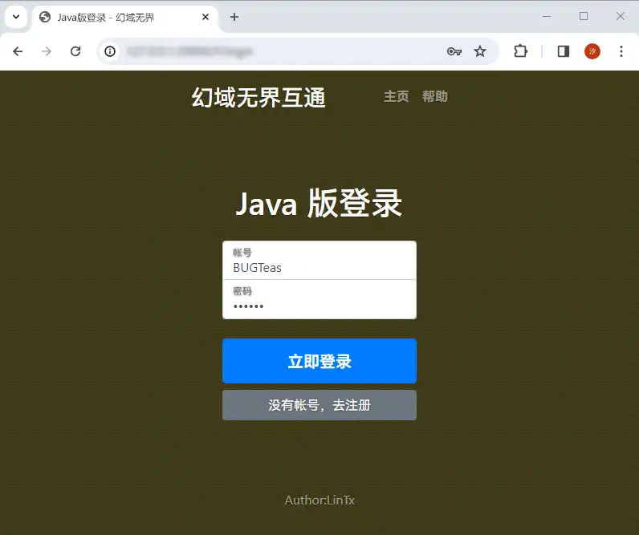
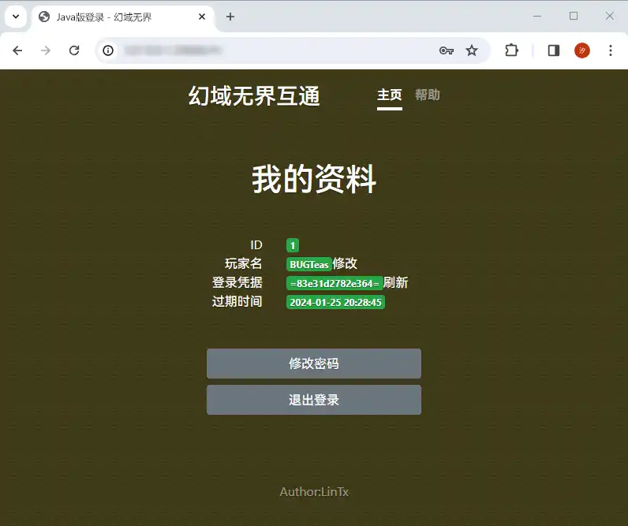
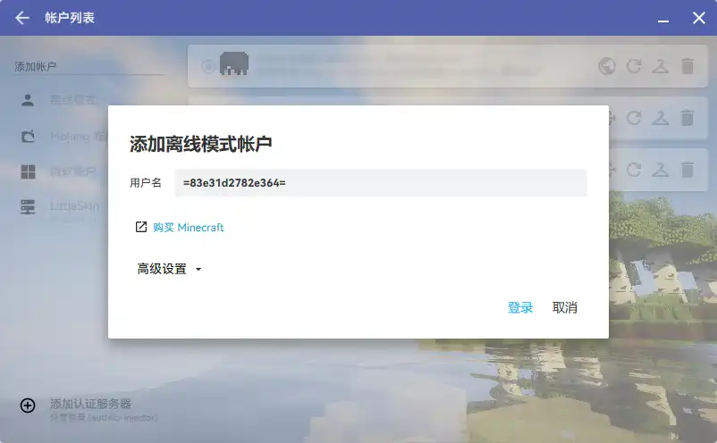
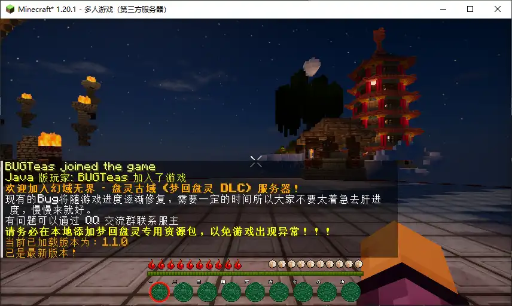

# 幻域无界游玩全指南及注意事项
欢迎您游玩支持基岩版互通的全新高版本盘灵服务器：幻域无界！本服使得大家能通过方便快捷的基岩版重新踏上盘古大陆，再次开启九载岁月精彩依旧的盘灵之旅！

在这里，我将会把基岩版和Java版游玩的各不同点及目前已知的问题列举，并提供登录服务器及绑定账户的教程，希望大家多加留意！

### 特别提示

目前页面尚未完善，待更新（服主最近考试没空）

### 基岩版登录

服务器使用FRP隧道技术连接，安全系数高，但为了确保服务器延迟更低，隧道会不定期更换，而作为一个初创服务器，我们也没有足够的资金以支撑域名的使用，所以服务器的地址也会随着隧道的更换而变更，请留意群公告中更新的地址列表，每当地址变更它都会更新并在群内弹窗提示。

在开始前，你需要确保你的基岩版客户端版本在服务器支持的范围内（目前是1.20.40 ~ 1.20.51），如果不知道如何找到并安装正确的版本，可以参考：[Minecraft 安装和配置指南](./../1919810/MCGuide/)

之后就可以 **添加群公告中的服务器地址** 到你的基岩版客户端了，但一定要确保微软账户已经正常登录，否则服务器会拒绝连接请求。\
有关基岩版添加并连接服务器，详见：[基岩版加入服务器](./../1919810/MCGuide/connect/bedrock.js)

### Java 版登录

目前支持版本为1.20.1（推荐，梦回盘灵指定版本）~ 1.20.4（为兼容 GeyserMC 互通做的 ViaVersion 向上兼容，虽然能玩但资源包会出问题）

当玩家通过Java版直接连接服务器时，会返回以下错误：

这是因为Java版登录通道虽然使用离线账户系统，但出于安全性考虑，我为其部署了依靠网页进行验证的 WebAuth 登录插件，此时我们需要在指定的网页中完成登录操作。首先打开链接 [showLink](fantasy-continent-unbounded/login) 进入登录页面：

如果未进行注册，需要您进行注册，点击下方的“没有账号，去注册”进入注册界面：

此处的“账号/玩家名”最短长度为4位，只能包含数字、大小写英文、下划线、英文横杠。将密码设置完毕后点击“立即注册”即可完成注册，之后会回到登录界面，输入刚才注册的账号和密码：

点击“立即登录”，进入账户资料界面。这里的玩家名默认是注册时的账号，可以修改但需慎重，修改后原来的玩家数据会失效，回到种族选择广场（改回去即可恢复）

“登录凭据”只能查看一次，之后需通过点击旁边的“刷新”将其重置后才能查看，之后原来的凭据将失效。在超出下方的“过期时间”后凭据会自动刷新重置，需要你回到网站重新获取。

在启动器上使用凭据作为名称，新建一个离线账户。这里以 HMCL 为例：

使用该离线账户启动游戏，之后方可进入服务器：

### 使Java版和基岩版共享同一玩家数据

如果你想在Java版和基岩版之间来回切换而不想数据分开，那么你可以使用 Floodgate 插件的账户绑定功能，它能使你的基岩版账户使用指定的Java版账户的数据，从而实现在不同的客户端下游戏数据共用。

有关其操作，可见：[将Java版玩家数据共享给基岩版](./documents/linkaccount.md)

### 游玩注意事项

### 已知问题

