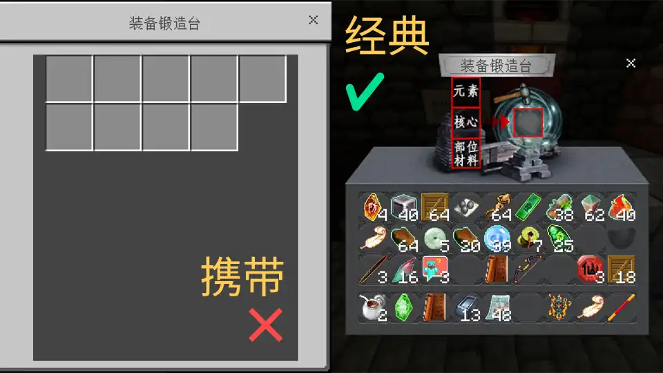
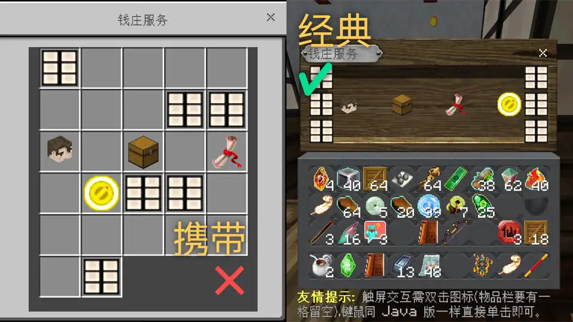
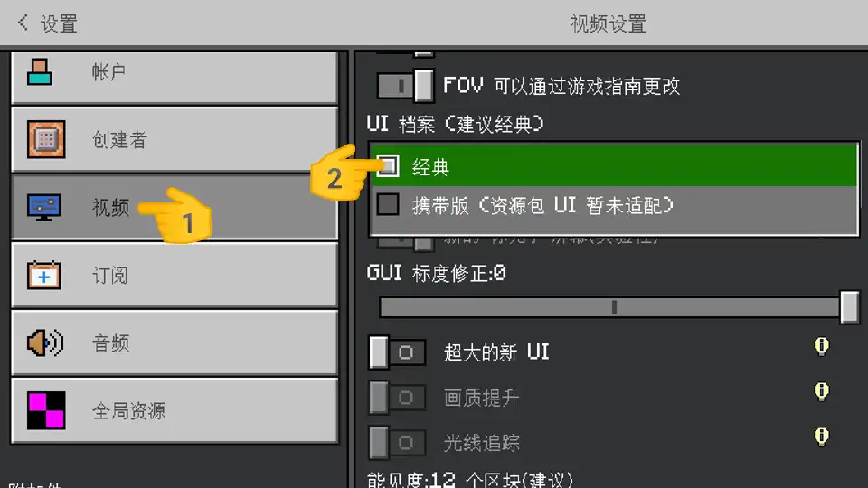
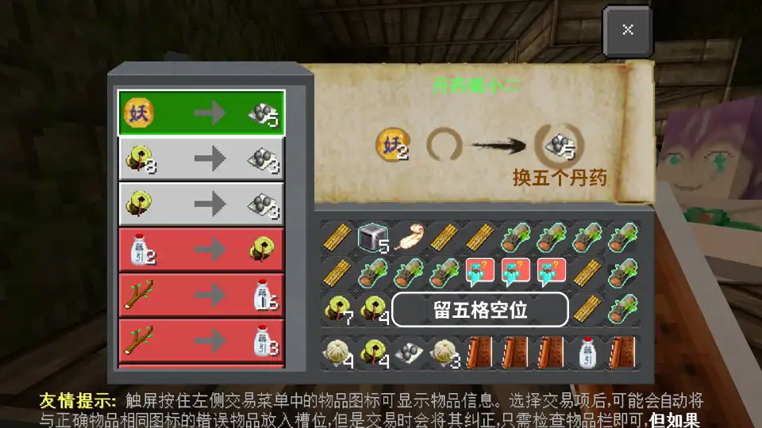
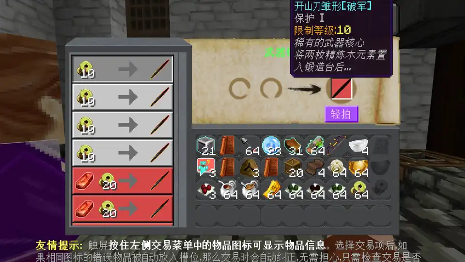
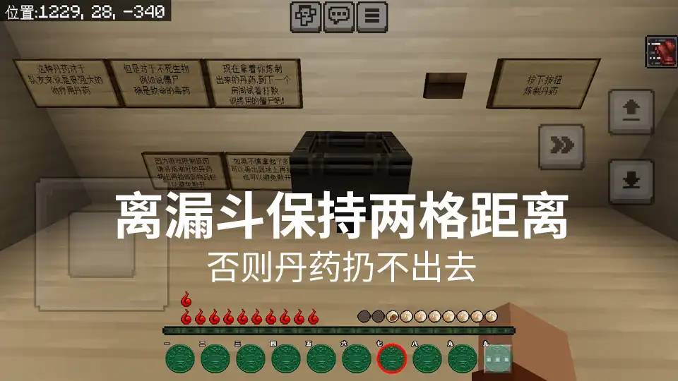
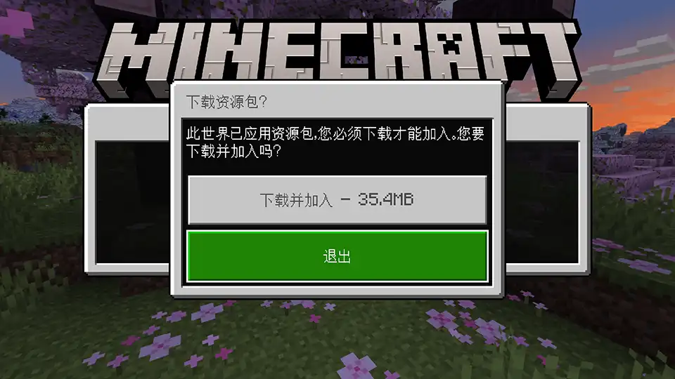
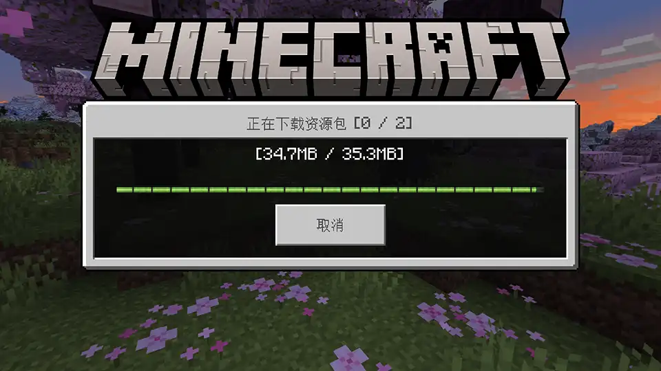
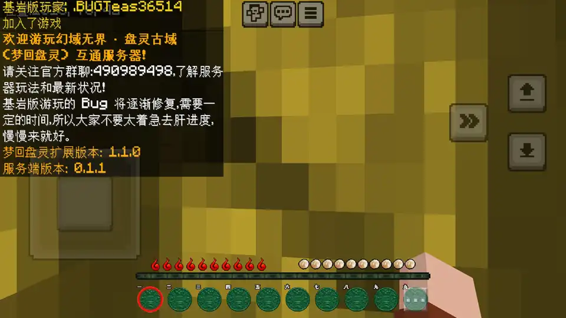
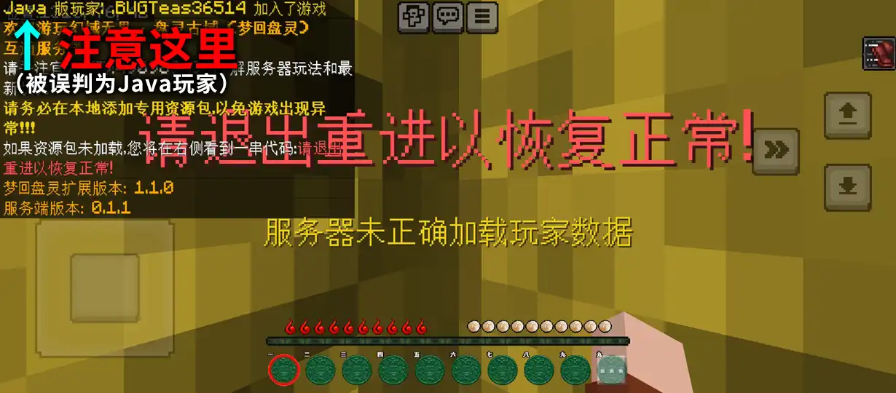

# 基岩版进服指南
首页 / 指南 / 基岩版

### 版本要求
目前服务器支持的基岩版版本号为：1.20.40 ~ 1.20.72（文档更新不及时，具体请看群公告）

支持 Android、iOS、Windows 10/11 以及各游戏主机，版本号要求都是一样的，只要能够安装上即可。

Android / Windows 的基岩版安装教程可见：[Minecraft 安装和配置指南](?article=1919810/MCGuide/)

### 进服地址
提供多个指向同一服务器的地址，但它们不固定，需要您从群公告获取，并留意其变更。

<!--### 游戏内已知问题（重要）
以下 Bug 都可以避免，为确保游戏体验请务必留意：

1. [携带版或第三方 UI 导致界面异常，钱庄末影箱布局错乱、武器锻造无法使用等](./bedrock/problem/ui.md)
2. [交易后物品悬浮而不归位；左侧列表选择后放入槽位的物品不正确；选择后总是自动跳转......](./bedrock/problem/trade.md)
3. [漏斗投放物品后自动传送，导致界面消失](./bedrock/problem/hopper.md)
4. [丹药/箭支/退火符/击退符/万春羹无法移动](./bedrock/problem/stack.md)
5. [钱庄末影箱，触屏点击没有响应](./bedrock/problem/enderbox.md)

以下 Bug 目前超出了我的解决能力，只能坐和放宽：

1. 丹药没有颜色且不能查看其属性：由于基岩版不支持自定义药水，而间歇泉尚未对此提供相关解决方案，颜色目前无解。但可以将属性直接写在名称 NBT 上，不过盘灵丹药数量繁多，想要涵盖所有的丹药非常困难，如果您对盘灵的丹药了如指掌，欢迎来和我合作，共同将其修复完善！

如果有其他的 Bug，请及时向我反馈。-->

## 先别急着进服！！
基岩版在游玩的过程中有不少常见的Bug，但是都有解决的方法，请往下看：

## 携带版或第三方 UI 导致界面异常
这将导致钱庄末影箱布局错乱、武器锻造无法正常使用。
### 钱庄末影箱、武器锻造台布局错乱
这是由于携带版 UI 的自适应布局导致的。

在设置 > 视频中将 UI 档案设置为经典即可解决。

### UI 界面出现 Bug
这很有可能是与第三方UI资源包发生冲突导致的。请检查 UI 冲突（懂点英文还可以通过内容日志来分析），当然最好就不要添加第三方 UI 了。

目前经过测试 Ty-el's UI 和 Cube UI 虽然会影响界面美观，但是不影响交互体验。对 VDX（Vanilla deluxe，仿 JE 界面）做了特别适配，可以完美兼容。

## 交易常见问题解决方法
### 交易项图标都一样，触屏该如何区分？
服务器的资源包对UI进行了修改，在左侧选栏中**每个图标按住都会显示其详细信息**：

<video autoplay loop muted><source src="./bedrock/problem/trade/get-info.mp4" type="video/mp4"/></video>

### 选择交易项后，自动放入槽位的物品图标相同但不正确
比如用五枚木元素换一枚精炼木元素，此前身上已经有数枚精炼木元素了，那么在选择交易项后可能会自动将图标和普通木元素相同的精炼木元素放入槽位：

<video autoplay loop muted><source src="./bedrock/problem/trade/same-icon-incorrect.mp4" type="video/mp4"/></video>

这是由于基岩版对 NBT 的支持不完善导致的，但幸好间歇泉对其做出了修复，**只要背包中有足够的正确物品，就能无视槽位上的错误物品，进行正确的交易**。

也就是说，即使放入槽位的是精炼木元素，但背包中还有足够的普通木元素，那么交易时就会**消耗背包中的普通木元素，而不是槽位中的精炼木元素**。

但如果自动放入的物品数量不够，基岩版会将**交易物品变红不能交易**。即使正确物品足够，槽位中的是错误物品。

<video autoplay loop muted><source src="./bedrock/problem/trade/same-icon-blocked.mp4" type="video/mp4"/></video>

这时就需要**手动将错误物品换成正确物品**，之后千万不要在左侧重新选择，否则又会被自动放错。

<video autoplay loop muted><source src="./bedrock/problem/trade/same-icon-rectify.mp4" type="video/mp4"/></video>

### 交易后有物品悬浮跟随手指
<video autoplay loop muted><source src="./bedrock/problem/trade/float-and-follow.mp4" type="video/mp4"/></video>

遇到此问题**可能是因为交易失败，但不完全是**，将悬浮物品放到背包中，再检查一下有没有交易得来的物品，如果有则交易成功，否则失败。

造成交易失败常见原因：
1. **书本未阅读**：在梦回盘灵中，为确保剧情完整，只有书本被阅读过才能用于交易；
2. **背包中没有交易所需的原材料**：在上一个问题中提到，基岩版会将图标相同但未必正确的物品放入槽位，而背包中又没有正确的物品。

### 交易丹药
在 0.4 版本后，丹药交易得到了很大的改善。完美解决了丹药散开问题。

但是其原理是交易一份标有叠放数值的虚假丹药，再自动转换为叠放的真实丹药，所以交易时要**确保背包始终至少留有一格空位**，否则点击交易时会无响应。
<!--由于梦回盘灵的丹药一次交易至少几份叠放，**这导致在交易时只有其中一个落入背包，其余的都会悬浮跟随**，需要将其扔出再捡回才能正常叠放。

<video autoplay loop muted><source src="./bedrock/problem/trade/potion-float.mp4" type="video/mp4"/></video>

但如果点交易无响应，则是因为背包中的空间不足以丹药逐个存放导致的，这也是间歇泉的一个 Bug 。

比如要换**五个新手疗愈丹**，那么背包中就至少要有**五个空位**，即使交易后是叠放的。

-->
### 选择交易项后总是自动跳转到其他项
如果我没猜错的话，交易时最折磨人的问题非它莫属了：

<video autoplay loop muted><source src="./bedrock/problem/trade/auto-redirects.mp4" type="video/mp4"/></video>

此问题只**发生在需要提供两个物品进行交易的场景**，包括皇城铁匠铺的武器销售员。

解决的方法也是非常简单，**重新打开交易界面，一次性选择好交易项，哪都别点**，即可正常交易：

<video autoplay loop muted><source src="./bedrock/problem/trade/auto-redirects-solve1.mp4" type="video/mp4"/></video>

又或者**把槽位上的物品拿下来，再一次性选择好交易项**，也同样可以正常交易：

<video autoplay loop muted><source src="./bedrock/problem/trade/auto-redirects-solve2.mp4" type="video/mp4"/></video>

**建议在每次交易前都按下紫色“轻拍”按钮**，确认是否为所需物品，减少不必要的损失：

注：该按钮在 0.4 更新后全局显示

## 漏斗投放问题
### 漏斗投放物品后自动传送，导致界面消失
在传送过程中，如果玩家打开了漏斗界面，那么可能会触发 Bug 导致进入摄像机模式，界面被隐藏，**需要退出重进才能恢复**。

<video autoplay loop muted><source src="./bedrock/problem/hopper/bug.mp4" type="video/mp4"/></video>

### 最大程度避免
在被传送的一瞬间不要进行任何操作，如果还是出现的话，请退出重进并向我反馈。

<video autoplay loop muted><source src="./bedrock/problem/hopper/avoid.mp4" type="video/mp4"/></video>

### 目前已被修复的漏斗
服务器已将几个最容易触发此 Bug 的漏斗进行修复，它们分别是：奈何桥、雨竹、兔子仙境（人族支线）以及圣山兑泽。但在修复后它们的操作方式稍有变化，具体如下：

**奈何桥、雨竹、兔子仙境**

在将物品扔进漏斗后，先关闭界面，然后稍微走动一下之后就会开始传送

<video autoplay loop muted><source src="./bedrock/problem/hopper/relife.mp4" type="video/mp4"/></video>

**圣山兑泽**

在投入足够量的息壤后，会一直闪烁提示“请尽快离开沼泽”，这时请离开漏斗至少 5 格，之后就会将沼泽堵住。

<video autoplay loop muted><source src="./bedrock/problem/hopper/swamp.mp4" type="video/mp4"/></video>

## 丹药等物品无法移动
为确保基岩版可正常使用丹药，并优化游戏体验，服务器添加了物品增量叠放插件，将**各类丹药、退火符、击退符、佛跳墙、万春羹、兔肉煲的叠放上限调整到了 64 个**。

但是在基岩版中由于间歇泉互通的限制，这些调整过的物品在移动和扔出时会出现问题。

### 移动物品位置（0.4 更新后已得到改善）
虽然**非标准叠放的物品不能正常移动**，但在触屏下通过**互换物品位置**的方法也同样能达到移动的目的：

<video autoplay loop muted><source src="./bedrock/problem/stack/move-touch.mp4" type="video/mp4"/></video>

而键鼠就**只能扔出再捡回**以进行不理想的移动了。将鼠标悬停在目标物品上，按 Ctrl+Q 扔出：

<video autoplay loop muted><source src="./bedrock/problem/stack/throw-out-mouse.mp4" type="video/mp4"/></video>

需要注意的是，移动炼丹锅（漏斗）上的东西时，要**与其保持一定距离**，不然扔不出来。
<!--

### 将炼制好的丹药放入背包
像 Java 那样按 Shift 是不可能的了，即使是 Win10 基岩这样操作也会使其散开。需要扔出再捡回。首先离炼丹锅（漏斗）保持一定距离，不然扔不出来：

触屏选中丹药，点击界面外就能将其扔出：

<video autoplay loop muted><source src="./bedrock/problem/stack/throw-out-touch.mp4" type="video/mp4"/></video>

键鼠可将鼠标悬停在丹药上，按 Ctrl+Q 扔出：

<video autoplay loop muted><source src="./bedrock/problem/stack/throw-out-mouse.mp4" type="video/mp4"/></video>

### 在物品栏中转移位置和叠放
由于超过标准叠放上限的物品无法正常移动和叠放，只能将其扔出再捡回，操作和取丹药同理。
-->
### 合并物品
要合并两组非标准叠放的物品，只能**将它们都扔出再捡回**。

但这个方法**不是 100% 有效的**，由于插件自身问题，物品可能会无法合并。（Java 版也存在此问题）

### 按“Q”或长按扔出后物品消失不见？
手持超过标准叠放上限的物品，按“Q”或长按将其扔出，却发现物品并未扔出去，而是消失了？！

<video autoplay loop muted><source src="./bedrock/problem/stack/throw-out-on-hand.mp4?ver=040" type="video/mp4"/></video>

其实它并没有消失，服务器依旧认为它还在原位，只需要打开一下物品栏<!--稍微改变一下物品栏的物品排列-->，它就会立刻刷新出来。

如果您真的需要将其扔出，请在界面中进行操作，不要手持按“Q”或长按。

## 钱庄末影箱，触屏点击没有响应
### 触屏没有响应
箱子中的按钮单击选中，界面右侧会显示按钮名称。再点一次即可取消选择：

<video autoplay loop muted><source src="./bedrock/problem/enderbox/select.mp4" type="video/mp4"/></video>

如需按下它，**请先取消选择，然后双击确认**：

<video autoplay loop muted><source src="./bedrock/problem/enderbox/double-click.mp4" type="video/mp4"/></video>

如果您的背包已满，没有空位，那么双击是没有反应的，只能将按钮和背包中的物品交换一下，这不会有问题的可以放心：

<video autoplay loop muted><source src="./bedrock/problem/enderbox/swap-item.mp4" type="video/mp4"/></video>

进入仓库空间后，除了两侧的挡板和按钮，里面的物品都可以自由移动，无需双击。

<video autoplay loop muted><source src="./bedrock/problem/enderbox/in-warehouse.mp4" type="video/mp4"/></video>

但是，请不要改变箱子中任何按钮的位置，否则**有可能会造成不堪设想的后果！**

**这不是在开玩笑**！！！已经有不少玩家因此损失了仓库里的一切，包括服主我也是。。。
<!--
### 界面布局错乱
这主要是由于携带版 UI 导致的，解决方法见此：[携带版 UI 导致界面错乱](javascript:autoScroll(subTitleIndex[2].offsetTop))

-->

## 以下 Bug 正在修复

### 丹药没有颜色且不能查看其属性
由于基岩版不支持自定义药水，而间歇泉尚未对此提供相关解决方案。但可以将颜色属性直接写在名称 NBT 上，不过盘灵丹药数量繁多，想要涵盖所有的丹药非常困难，目前 0.4.1 更新只修复了可服用的药丹、炼丹师专用的各种术丹和法丹（回春露、封喉等）将在下一版本（0.4.2）修复。

由于 0.4 更新后的丹药数据格式与旧版本不同，旧版本丹药依旧无法显示颜色及属性，且不能和新版丹药叠放，但不影响正常使用。为了便于区分，所有旧版丹药在左上角都标有“旧”字样。

如果有其他的 Bug，请及时向我反馈。

## 如果您已经知晓以上问题及其解决方法，那就继续往下看吧。

### 进服
如果不会添加第三方服务器，可以查看该教程：[基岩版加入服务器](https://bugtea.ya.sy/item.html?proFile=1919810/MCGuide/connect/bedrock.js)

在进服前您需要确保游戏中的 Microsoft（Xbox）账户已经登录，否则会被拒绝连接。（不同于Java版账户，基岩版的账户不等同于正版，可以免费注册登录）

第一次进服需要下载专用的资源包。点击下载即可开始：

之后便会进入服务器，除非资源包更新，否则下次进服不会要求重新下载。

**特别注意：基岩版玩家请不要随意更改自己的 ID，否则会导致记分板失效**，除了背包数据还在，其他的就什么都没了，重生转生都不行！这号就相对于废了。。。

由于实现区分 Java / 基岩版玩家的 Floodgate 插件时常摸鱼，导致服务器**有时会加载错误的玩家数据**。如果弹出以下提示，则表明登录错误，服务器未能正确加载玩家数据，且误判为了 Java 玩家。（见左上角消息）请退出重新进入，否则**游玩数据将不会保存**：

**有关“无法连接到世界”，通常是由于以下问题：**

1. 地址/网络异常：请确保网络正常，并检查地址是否输入正确。
2. 地址暂时不可用：由于服务器的面板对基岩版连接有一定限制，在某些情况下会阻断基岩版的连接。为了避免此问题，我提供了基于 FRP 实现的备用地址，由于隧道不是长期有效的，若出现问题需再次更换，所以**备用地址不固定，需要您从群公告获取，并留意其变更**。**强烈建议大家添加多个地址**，以便在某个地址不可用时切换到另一地址进服，所有地址均指向同一服务器，无需担心玩家数据。
3. 游戏 Bug：发出请求后服务器能接收得到，但客户端异常一直反复请求，导致连接失败。需要重启游戏。（网络不稳定的情况下容易发生）

### Java 玩家数据同步到基岩版
如果你想**使 Java 版和基岩版共用同一个玩家数据**，那么你可以使用 Floodgate 插件的账户绑定功能，它能使你的基岩版账户使用指定的 Java 版账户的数据，从而实现基岩和 Java 版下游戏进度同步。

有关其操作，可见：[将 Java 版玩家数据共享给基岩版](./linkaccount.md)

/showNav();console.log("2024.4.3 随幻域无界 0.4.0 版本更新")