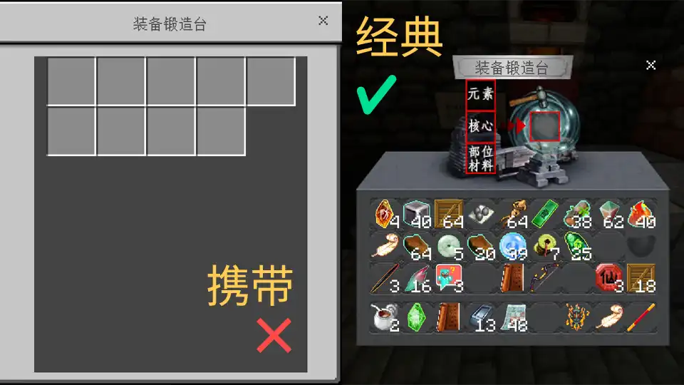
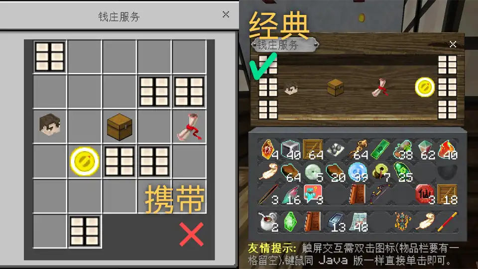
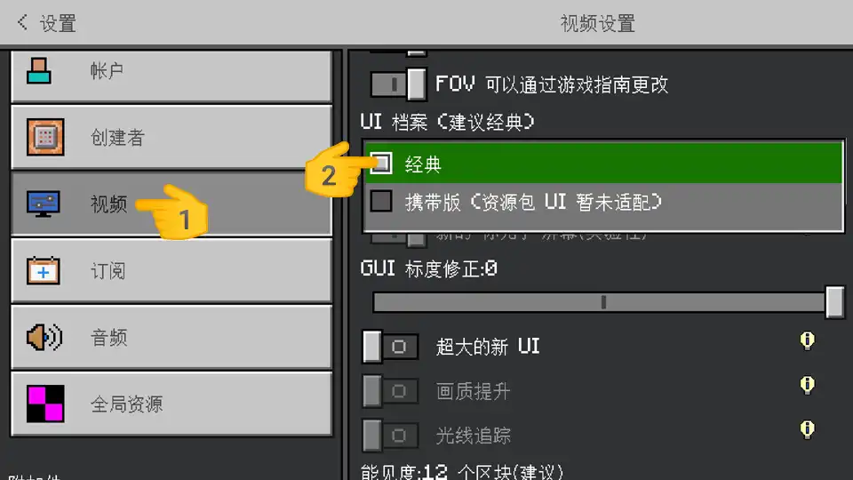

# 携带版或第三方 UI 导致界面异常
首页 / 指南 / 基岩版 / 游戏内已知问题

### 钱庄末影箱、武器锻造台布局错乱

这是由于携带版 UI 的自适应布局导致的。在设置 > 视频中将 UI 档案设置为经典即可解决。

### UI 界面出现 Bug
这很有可能是与第三方UI资源包发生冲突导致的。请检查 UI 冲突（懂点英文还可以通过内容日志来分析），当然最好就不要添加第三方 UI 了。

目前经过测试 Ty-el's UI 和 Cube UI 虽然会影响界面美观，但是不影响交互体验。对 VDX（Vanilla deluxe，仿 JE 界面）做了特别适配，可以完美兼容。