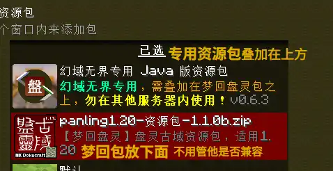

# Java 版进服指南
首页 / 指南 / Java 版

### 版本要求
目前支持版本为1.20.1（推荐，梦回盘灵指定版本）~ 1.20.4（为兼容 GeyserMC 互通做的 ViaVersion 向上兼容，虽然能玩但资源包会出问题）
Java 版对平台要求不限（万物皆可），但相比基岩版对配置的要求更高，且对触屏不友好。

### 进服地址
提供多个指向同一服务器的地址，但它们不固定，需要您从群公告获取，并留意其变更。

### 资源包要求
由于Java版像基岩那样进服自动加载资源会导致告示牌变英文代码，需要玩家自行下载并添加：[showLink](https://www.123pan.com/s/0nHvjv-uyqHh.html)

由于专用资源包不包含材质和音乐，两个资源包都需要添加。

添加时请确保专用资源包在最顶上，以免发生冲突：

你也可以添加第三方的美化包，但必须在专用包下方，因为部分美化包针对某些 DLC 服务器修改过的游戏规则，对原版梦回盘灵的语言文本文件进行了修改，这些修改过的文本内容中提到的规则显然不同于原版梦回盘灵，对玩家造成极大的误解。

如果资源包未正确添加，进服后你会看到这样的画面：

注意：如果要进入其他同样拥有专用包的服务器，请先将我们服的专用包卸载！

### 进服
当玩家直接连接服务器时，会返回以下错误：

这是因为Java版登录通道虽然使用离线账户系统，但出于安全性考虑，我为其部署了依靠网页进行验证的 WebAuth 登录插件，此时我们需要在指定的网页中完成登录操作。首先打开链接 [showLink](http://fcub-login.eo.mk/) 进入登录页面：

如果未进行注册，需要您进行注册，点击下方的“没有账号，去注册”进入注册界面：

此处的“账号/玩家名”最短长度为4位，**只能包含数字、大小写英文、下划线、英文横杠**。将密码设置完毕后点击“立即注册”即可完成注册，之后会回到登录界面，输入刚才注册的账号和密码：

点击“立即登录”，进入账户资料界面。这里的玩家名默认是注册时的账号，可以修改但需慎重，修改后原来的玩家数据会被释放，可被他人占用，而您也将因为新建玩家数据而回到新人广场重新开始（改回去即可恢复）

“登录凭据”只能查看一次，之后需通过点击旁边的“刷新”将其重置后才能查看，之后原来的凭据将失效。在超出下方的“过期时间”后凭据会自动刷新重置，需要你回到网站重新获取。

在启动器上使用凭据作为名称，新建一个离线账户。这里以 HMCL 为例：

使用该离线账户启动游戏，之后方可进入服务器：

在凭证过期前，你可以直接使用凭证登录服务器，而无需打开网页。

由于实现区分 Java / 基岩版玩家的 Floodgate 插件时常摸鱼，导致服务器**有时不能正确地辨认玩家**。如果弹出以下提示，则表明**您被误判为基岩版玩家**，导致配置出错。这会影响到您的正常游戏，**请退出重新进入，否则将无法正常游玩**：

### Java 玩家数据同步到基岩版
如果你想**使 Java 版和基岩版共用同一个玩家数据**，那么你可以使用 Floodgate 插件的账户绑定功能，它能使你的基岩版账户使用指定的 Java 版账户的数据，从而实现基岩和 Java 版下游戏进度同步。

有关其操作，可见：[将 Java 版玩家数据共享给基岩版](./linkaccount.md)