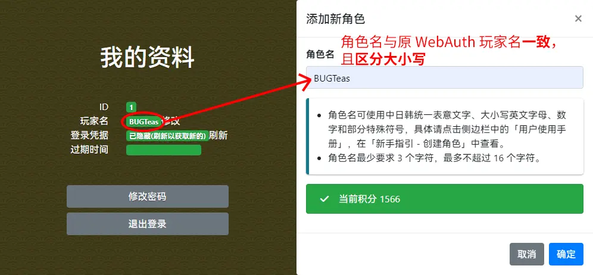
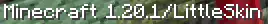
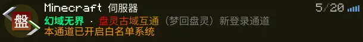
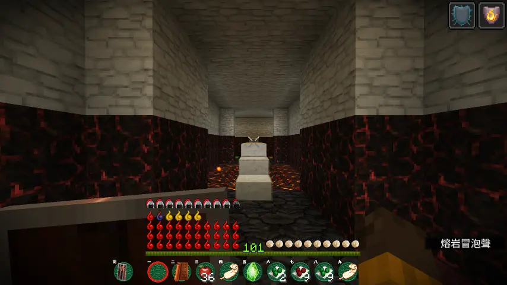
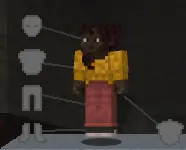
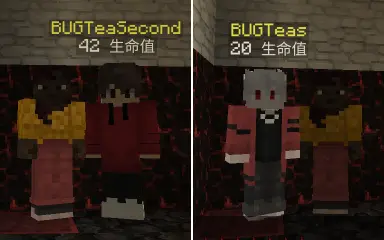

# 新系统 LittleSkin 登录
首页 / 指南 / Java 版

由于原 WebAuth 登录系统过于老旧，且仍然存在安全隐患，现决定启用 LittleSkin 外置登录系统，即日起至 4 月 6 日（两周）给大家过渡，之后将正式停用 WebAuth 登录，请大家尽快完成账户迁移，感谢您的配合！

### 注册
LittleSkin 的使用教程见：[外置认证设置指南 (LittleSkin 皮肤站)](?article=MCGuide/skinSite/littleskin.js)

如果您曾在 WebAuth 登录下游玩过，则角色名必须和原来在 WebAuth 中的玩家名一致，且区分大小写，否则数据将不同步。（已有同名角色的可跳过）

### 白名单申请
为了更高效地管理服务器，新登录系统启用了**白名单系统**。

添加好角色后，请填写腾讯文档提交白名单申请：[showLink](https://docs.qq.com/form/page/DR0JIYnh5Ykt6ZG9V)

注意：允许一个 QQ 号申请两个玩家账户，多出的一律不批，除非向我申请注销原有的玩家。

### 登录进服
使用**外置登录**启动 Minecraft

添加群公告中的新连接地址，之后应显示如下：

直接点击进服，玩家数据和原 WebAuth 登录一致。

### 皮肤问题
由于外置登录对 Velocity 代理的支持尚未完善，玩家无法直接看见自己的皮肤：

不过请放心，对方的皮肤是互相正常显示的：

