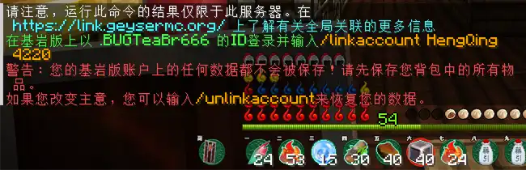

# 账户绑定
在本服务器中你可以通过指令将基岩版账号绑定到 Java 版，实现不同平台共用一个玩家数据。**（无需正版）**

### 了解概念

通常使用基岩版登录服务器，玩家信息会显示成这样：


#### 其中玩家的名称前面多了一个英文点“.”，且空格会被替换为下划线“_”。

名称前带有这个“.”的玩家都未绑定到 Java 版，在这种状态下玩家数据只能通过基岩版访问，绑定后使用的是Java版玩家的数据，所以**如果你在绑定前的基岩版下玩了一段时间，那么在绑定之后将彻底回到开始**。

至于Java的玩家信息应该不必多说了吧，就是普通的离线账户。

### 绑定

基岩和 Java 版同时登录到服务器，然后**打开 Java 端的聊天栏，输入以下指令**：
```
/linkaccount .<基岩版玩家名称>
```
注意基岩版玩家名称前面的“.”，上面有提到过，只有基岩版玩家名称前面带“.”\
如果你的基岩版也在线，还可以输入“.”后在自动填充列表中找到你的基岩版玩家名称。\
注意基岩版玩家名称的空格会被替换成下划线。

输入指令后，服务器会**返回一条消息引导用户在基岩版上进行下一步**操作。\
之后**在基岩端中按照 Java 端中返回的提示，在聊天栏中输入指令**，它大概是这样的：

```
/linkaccount <Java 版玩家名称> <验证码>
```
若绑定成功会弹出全屏提示并下线。再次连接就会**登录到绑定的 Java 版账户，使用其档案游戏**。绑定后的玩家数据是相通的，这意味着你可以在 Java 版和基岩版之间使用同一数据进行游戏。\
而**原先基岩版的玩家数据也会失效**，不过仍然会保留在服务器中，解除绑定后方可恢复。

### 解除绑定

如需解除绑定，可以使用已绑定的账户进入服务器（无论是 Java 版还是基岩版都行），然后在聊天栏中输入以下指令：
```
/unlinkaccount
```
之后返回如下提示则表示解绑成功。


之后基岩版进入服务器就会**恢复原先绑定前的玩家数据**。

### 演示

下图以一个**名为“BUGTeaBr666”的基岩版玩家**绑定一个**名为“HengQing”的 Java 版玩家**为例，首先**在 Java 版输入指令**


之后会返回如下结果：（虽然提示不再保存原基岩版数据，但解绑后就能恢复）



接着根据提示在基岩版输入指令


操作成功自动下线

